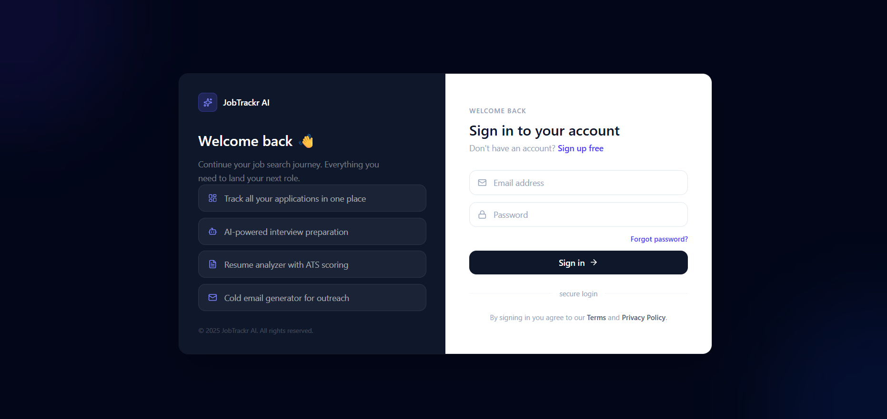
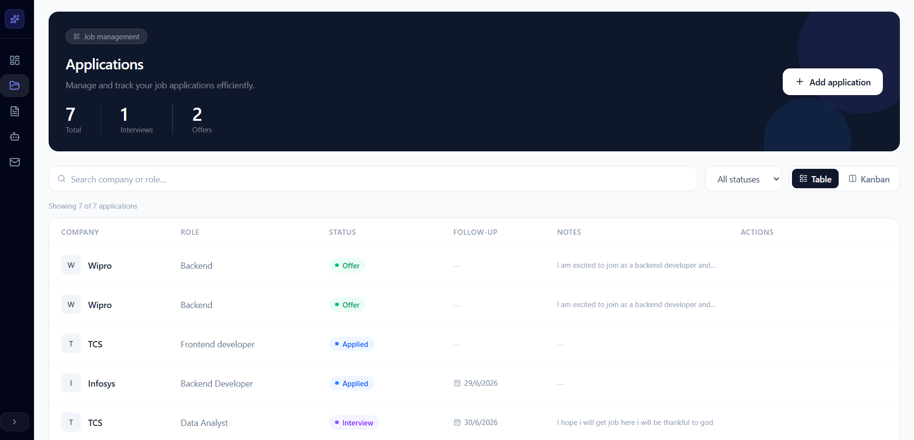
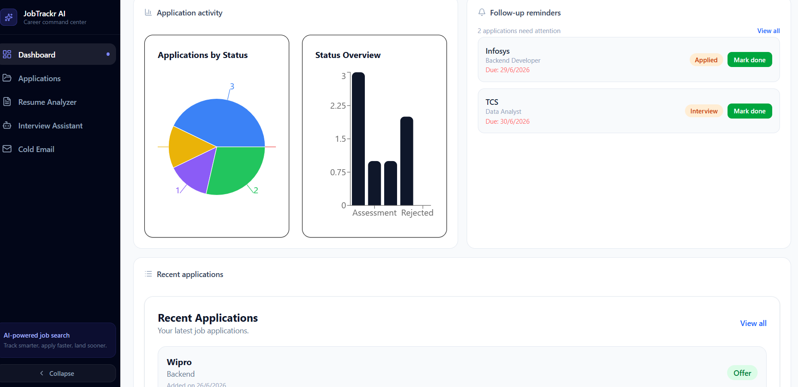
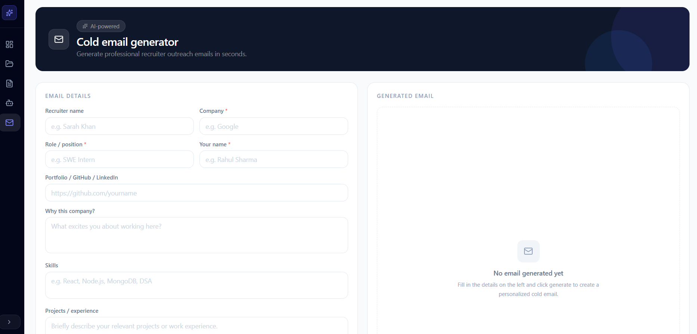
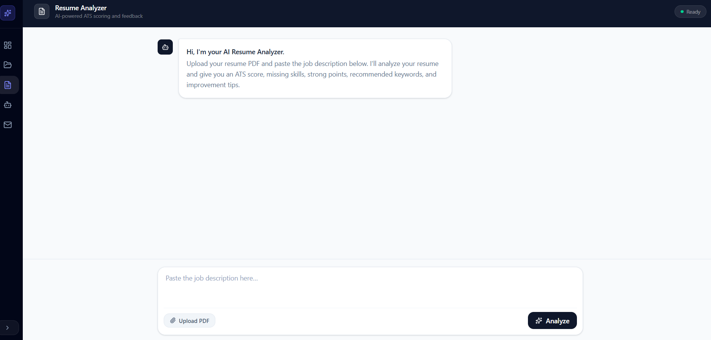
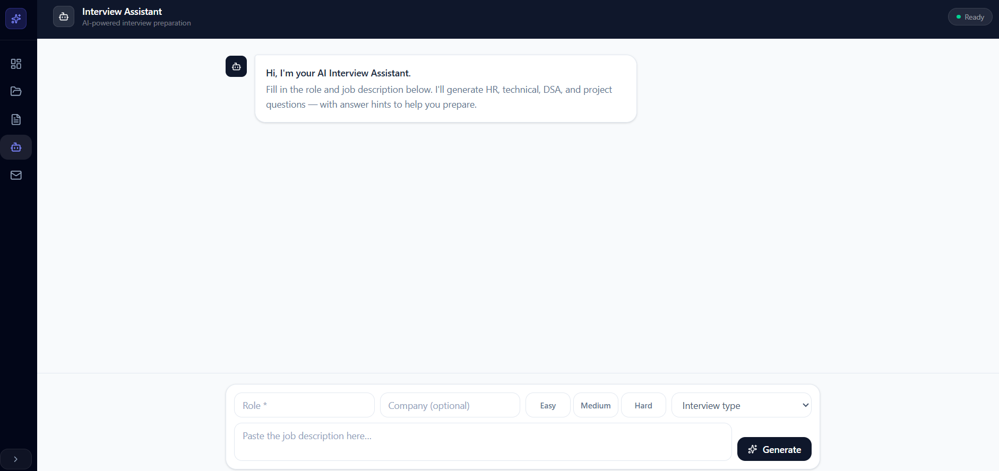

# JobTrackr AI 🚀

JobTrackr AI is a full-stack MERN + AI career assistant platform that helps job seekers track job applications, manage follow-ups, analyze resumes, generate cold emails, and prepare for interviews using AI.

## 🔗 Live Demo

Frontend: https://jobtrackr-ai-pearl.vercel.app
Backend: https://jobtrackr-ai-backend.onrender.com

---

## 🌟 Features

### 🔐 Authentication

* User signup and login
* Email OTP verification during signup
* Forgot password with OTP
* JWT authentication using HTTP-only cookies
* Protected routes
* Production-ready cookie configuration
* User-friendly login/signup error handling

### 📊 Dashboard

* Application overview
* Status-based analytics
* Dashboard charts
* Recent applications
* Follow-up reminders
* Quick access to AI tools

### 📁 Job Application Tracker

* Add, edit, delete, and view job applications
* Track company, role, job link, status, follow-up date, and notes
* Search and filter applications
* Table view
* Kanban board view
* Drag-and-drop status updates

### 📅 Follow-up System

* Follow-up due reminders
* Mark follow-up as done
* Follow-up count on dashboard

### 📧 AI Cold Email Generator

* Generate personalized recruiter outreach emails
* Supports multiple tones:

  * Professional
  * Friendly
  * Confident
  * Short and Direct
* Uses Gemini AI API from backend

### 📄 AI Resume Analyzer

* Upload resume PDF
* Paste job description
* Extract resume text from PDF
* Analyze resume using AI
* ATS score
* Missing skills
* Strong points
* Improvement suggestions
* Recommended keywords
* Final advice
* Chat-style AI interface

### 🎤 AI Interview Assistant

* Generate interview questions based on role and job description
* Supports interview types:

  * Mixed
  * HR
  * Technical
  * DSA
  * Project Based
* Provides:

  * Questions
  * Approach
  * Sample answer direction
  * Key points
  * Final preparation tips

### ✉️ Email OTP System

* Signup OTP email
* Forgot password OTP email
* Transactional emails handled using Brevo API

---

## 🛠️ Tech Stack

### Frontend

* React
* Vite
* Tailwind CSS
* React Router
* Axios
* Recharts
* dnd-kit
* Lucide React

### Backend

* Node.js
* Express.js
* MongoDB
* Mongoose
* JWT
* Bcrypt
* Cookie Parser
* CORS
* Multer
* pdf-parse
* Gemini AI API
* Brevo API

### Database

* MongoDB Atlas

### Deployment

* Frontend: Vercel
* Backend: Render
* Database: MongoDB Atlas
* Email Service: Brevo API

---

## 📂 Project Structure

```txt
JobTrackr-AI/
├── backend/
│   ├── config/
│   ├── controllers/
│   ├── middleware/
│   ├── models/
│   ├── routes/
│   ├── utils/
│   ├── app.js
│   └── package.json
│
├── frontend/
│   ├── src/
│   │   ├── api/
│   │   ├── components/
│   │   ├── context/
│   │   ├── pages/
│   │   ├── App.jsx
│   │   └── main.jsx
│   ├── vercel.json
│   └── package.json
│
└── README.md
```

---

## ⚙️ Installation and Setup

### 1. Clone the Repository

```bash
git clone https://github.com/Priyanshu45Kumar/Jobtrackr-AI.git
cd Jobtrackr-AI
```

---

## 🔧 Backend Setup

```bash
cd backend
npm install
```

Create a `.env` file inside the `backend` folder:

```env
PORT=5000
MONGO_URI=your_mongodb_connection_string
JWT_SECRET=your_jwt_secret
GEMINI_API_KEY=your_gemini_api_key
FRONTEND_URL=http://localhost:5173
NODE_ENV=development

BREVO_API_KEY=your_brevo_api_key
BREVO_SENDER_EMAIL=your_verified_sender_email
```

Run backend:

```bash
npm run dev
```

Backend will run on:

```txt
http://localhost:5000
```

---

## 🎨 Frontend Setup

Open a new terminal:

```bash
cd frontend
npm install
```

Create a `.env.development` file inside the `frontend` folder:

```env
VITE_API_URL=http://localhost:5000/api
```

Run frontend:

```bash
npm run dev
```

Frontend will run on:

```txt
http://localhost:5173
```

---

## 🔑 Environment Variables

### Backend Environment Variables

| Variable             | Description                               |
| -------------------- | ----------------------------------------- |
| `PORT`               | Backend server port for local development |
| `MONGO_URI`          | MongoDB Atlas connection string           |
| `JWT_SECRET`         | Secret key for JWT authentication         |
| `GEMINI_API_KEY`     | Gemini API key for AI features            |
| `FRONTEND_URL`       | Frontend URL for CORS                     |
| `NODE_ENV`           | Environment mode                          |
| `BREVO_API_KEY`      | Brevo API key for transactional emails    |
| `BREVO_SENDER_EMAIL` | Verified sender email in Brevo            |

### Frontend Environment Variables

| Variable       | Description     |
| -------------- | --------------- |
| `VITE_API_URL` | Backend API URL |

> Never commit `.env` files to GitHub.

---

## 📌 API Routes Overview

### Auth Routes

```txt
POST /api/auth/signup
POST /api/auth/verify-otp
POST /api/auth/resend-otp
POST /api/auth/login
POST /api/auth/logout
POST /api/auth/forgot-password
POST /api/auth/verify-reset-otp
POST /api/auth/reset-password
GET  /api/auth/me
```

### Application Routes

```txt
POST   /api/applications
GET    /api/applications
PUT    /api/applications/:id
DELETE /api/applications/:id
```

### Dashboard Routes

```txt
GET /api/dashboard/stats
```

### AI Routes

```txt
POST /api/ai/cold-email
POST /api/resume/analyze
POST /api/interview/generate
```

---

## 🧠 AI Features

JobTrackr AI uses Gemini API for:

* Cold email generation
* Resume analysis
* Interview question generation

All AI requests are handled through the backend to keep API keys secure.

---

## ✉️ Email Service

JobTrackr AI uses Brevo API for transactional emails.

Email features include:

* Signup OTP verification
* Forgot password OTP
* Password reset flow

Brevo sender email must be verified before sending emails.

---

## 🚀 Deployment

### Backend Deployment on Render

Render settings:

```txt
Root Directory: backend
Build Command: npm install
Start Command: npm start
```

Render environment variables:

```env
NODE_ENV=production
MONGO_URI=your_mongodb_connection_string
JWT_SECRET=your_jwt_secret
GEMINI_API_KEY=your_gemini_api_key
FRONTEND_URL=https://jobtrackr-ai-pearl.vercel.app
BREVO_API_KEY=your_brevo_api_key
BREVO_SENDER_EMAIL=your_verified_sender_email
```

Backend live URL:

```txt
https://jobtrackr-ai-backend.onrender.com
```

---

### Frontend Deployment on Vercel

Vercel settings:

```txt
Root Directory: frontend
Framework Preset: Vite
Build Command: npm run build
Output Directory: dist
```

Vercel environment variable:

```env
VITE_API_URL=https://jobtrackr-ai-backend.onrender.com/api
```

Frontend live URL:

```txt
https://jobtrackr-ai-pearl.vercel.app
```

---

## 🔁 React Router Vercel Rewrite

For React Router routes like `/login`, `/signup`, and `/dashboard`, add this file:

```txt
frontend/vercel.json
```

```json
{
  "rewrites": [
    {
      "source": "/(.*)",
      "destination": "/index.html"
    }
  ]
}
```

---

## ✅ Deployment Checklist

After deployment, test:

```txt
Signup with OTP
Login
Forgot password with OTP
Logout
Add application
Edit application
Delete application
Kanban drag and drop
Dashboard stats
Follow-up reminders
Cold email generator
Resume PDF analyzer
Interview assistant
```

---

## 📸 Screenshots

### Login Page


### Dashboard


### Applications Page


### Kanban Board


### AI Cold Email Generator


### AI Resume Analyzer


### AI Interview Assistant

## 📈 Future Improvements

* Application timeline
* Resume analysis history
* Interview preparation history
* Follow-up email generator
* Export applications to CSV
* Advanced analytics page
* AI career roadmap generator
* Notification system
* Dark mode
* Custom domain for production email sending

---

## 👨‍💻 Author

**Priyanshu Kumar**

Full Stack Developer focused on MERN stack, AI-powered web applications, and real-world career tools.

---

## 📄 License

This project is built for learning, portfolio, and educational purposes.
